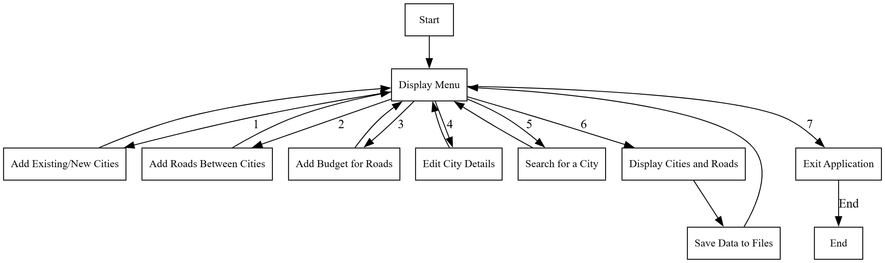
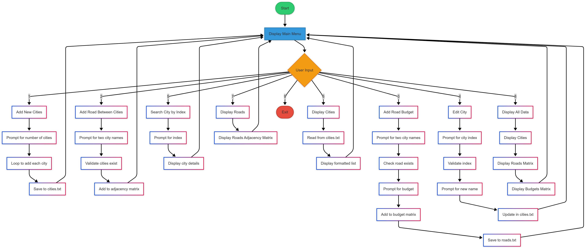

# 🏙️ Rwanda Cities and Roads Management System

A C++ console application for managing cities and road networks in Rwanda, developed for the Ministry of Infrastructure.

## 📋 Overview

This system helps manage and track:

- Cities (including Kigali and secondary cities)
- Road connections between cities
- Road construction budgets
- City information updates

## 📊 Flowcharts

The system's logic is documented through flowcharts:

### High-Level Overview


_High-level overview of the system's main operations_

### Detailed System Flow


_Detailed flow of all system operations and decision points_

These flowcharts provide a visual representation of the system's logic and decision-making processes.

## 🌟 Features

- **City Management**

  - Add new cities
  - Edit existing cities
  - Search cities by index
  - Display city database

- **Road Network Management**

  - Add roads between cities
  - Assign and manage road budgets
  - Display road network using adjacency matrices
  - Track road construction costs

- **Data Persistence**
  - Automatic saving to files
  - Data loading on startup
  - Beautiful formatted output

## 🚀 Getting Started

### Prerequisites

- C++ compiler (supporting C++11 or later)
- Make or similar build system

### Installation

1. Clone the repository

```bash
git clone https://github.com/Nbruchi/transport-system.git
```

2. Compile the program

```bash
g++ main.cpp -o transport-system
```

3. Run the program

```bash
./transport-system
```

## 📊 Data Structure

The system maintains:

- City database with indices
- Road network using adjacency matrices
- Budget information for each road
- Persistent storage in `cities.txt` and `roads.txt`

## 📝 Menu Options

1. Add new city(ies)
2. Add roads between cities
3. Add the budget for roads
4. Edit city
5. Search for a city using its index
6. Display cities
7. Display roads
8. Display recorded data on console
9. Exit

## 🔒 Data Validation

The system includes checks for:

- Duplicate cities
- Road existence before budget assignment
- Input type validation
- Data integrity

## 📁 File Structure

```
.
├── main.cpp          # Main program file
├── cities.txt        # City database
├── roads.txt         # Road and budget database
├── .gitignore        # Git ignore file
├── README.md         # This file
└── flowcharts/       # System flowcharts
    ├── summarized-flowchart.png
    └── detailed-flowchart.png
```

## 📄 License

This project is licensed under the MIT License - see the LICENSE file for details.

## 👥 Authors

- Bruce NKUNDABAGENZI - Initial work
